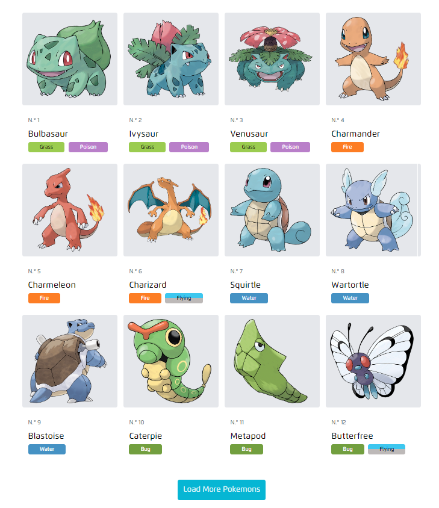
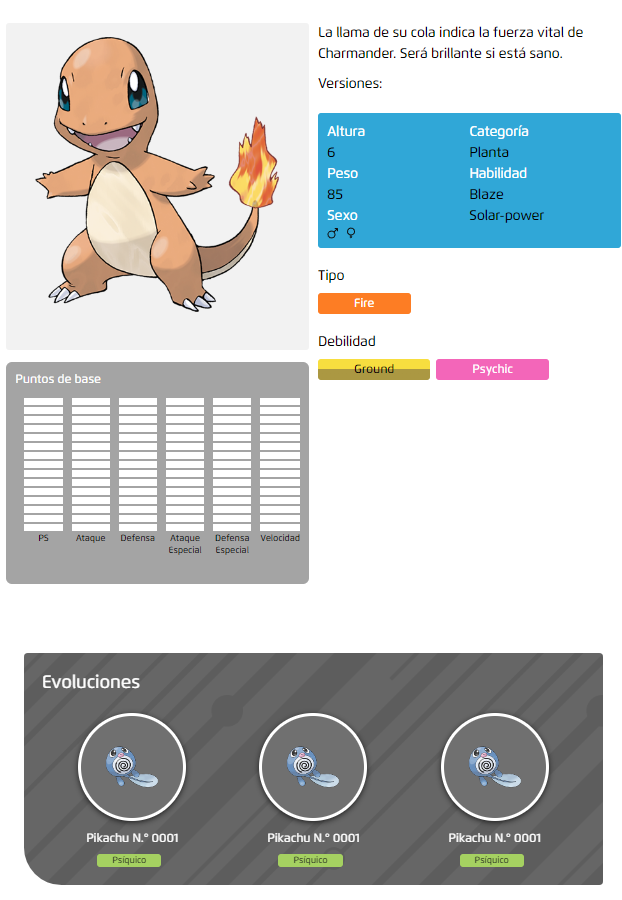

# Pokédex

## Descripción

Pokédex es una aplicación web que te permite explorar y descubrir información sobre diferentes Pokémon. Con una interfaz amigable y fácil de usar, los usuarios pueden buscar Pokémones obtener detalles como estadísticas, habilidades.

## Características

- Detalles completos de cada Pokémon, incluyendo estadísticas, habilidades.
- Interfaz intuitiva y atractiva, diseñada para usuarios de todas las edades.
- Totalmente responsive, compatible con dispositivos móviles y de escritorio.

## Capturas de Pantalla

## Instalación

1. Clona el repositorio: git clone https://github.com/ldkjvvier/Pokedex.git
2. Instala las dependencias: npm install
3. Inicia la aplicación: npm run dev

## Estado del Proyecto

Actualmente, el proyecto **Pokédex** se encuentra en desarrollo activo y se están añadiendo nuevas características regularmente.

# Créditos

El proyecto Pokédex fue desarrollado por _Javier Madariaga_ y está basado en React + TypeScript + Vite.
